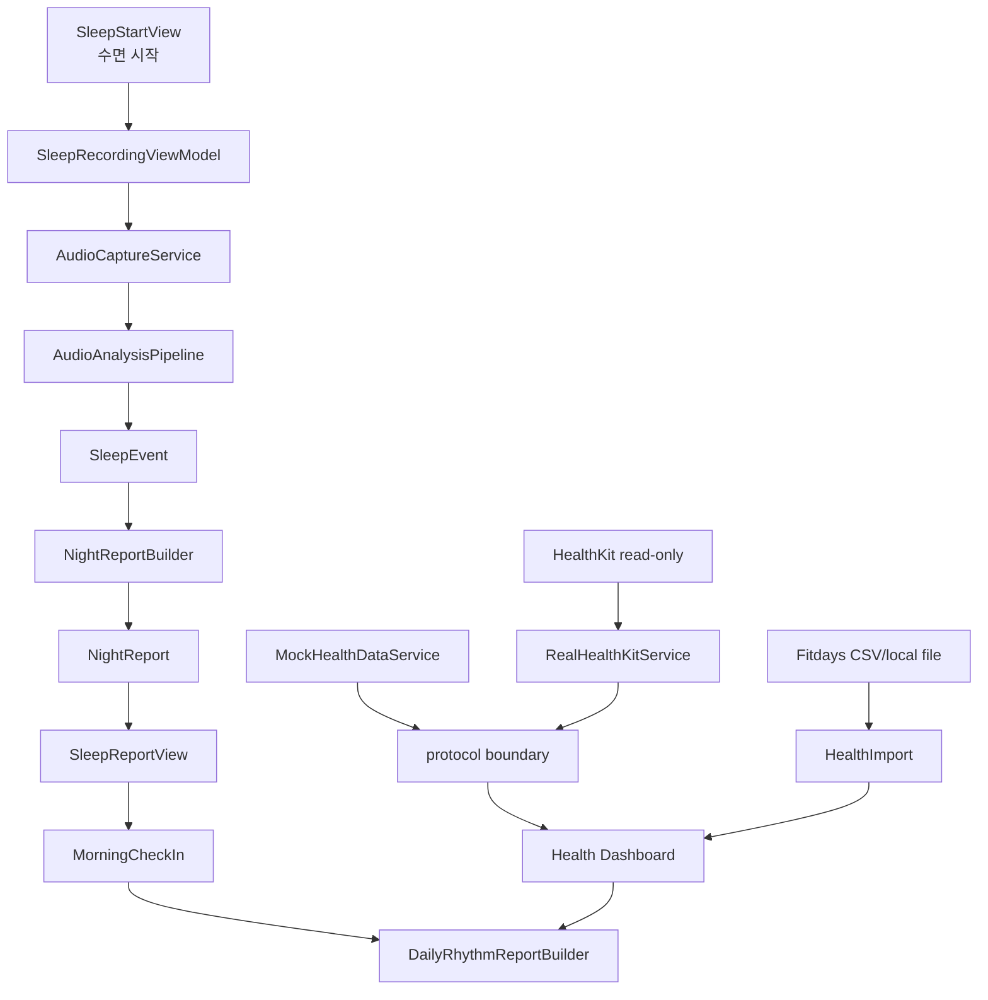
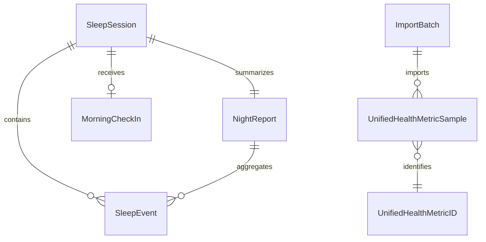

# Project & Architecture

## 제품 목적

NightBreath / 밤숨은 iPhone 온디바이스 수면 소리 분석에서 시작해 개인 건강 리듬 리포트로 확장되는 앱입니다.

| 구분 | 설명 |
| --- | --- |
| 시작점 | 수면 중 코골기, 이갈이 의심 소리, 호흡정지 의심 구간, 기침 의심 소리, 환경 소음 등을 로컬에서 분석 |
| 현재 UX | 수면 시작/종료, 아침 리포트, 이벤트 타임라인, 아침 컨디션 체크인 |
| 확장 방향 | HealthKit read-only 지표와 Fitdays local import 지표를 더해 Daily Rhythm Report 제공 |
| 제품 성격 | 웰니스/개인 참고용 보기 |
| 제품이 하지 않는 것 | 의학적 판정, 임상 지표의 정밀 산출, 의학적 조치 안내, 원격 분석, 클라우드 동기화 |

## 안전한 표현 기준

| 사용 가능 | 피해야 할 표현 범주 |
| --- | --- |
| 코골기 | 특정 수면 질환을 단정하는 표현 |
| 이갈이 의심 소리 | 이갈이를 확정하는 표현 |
| 호흡정지 의심 구간 | 임상 지표를 정밀 산출한다는 표현 |
| gasp-like 회복 호흡 | 질환 여부를 판정하는 표현 |
| 수면 소리 점수 | 건강 상태를 판정하는 점수 표현 |
| 오늘의 리듬 점수 | 의학적 조치가 필요하다는 표현 |
| 개인 패턴을 살펴보기 위한 참고용 보기 | 수면 소리와 건강 지표 사이의 원인/결과 단정 |

문구 변경 작업은 단순 카피 작업처럼 보여도 release gate에 영향을 줍니다. 의료 오해 가능성이 있으면 최소 `5.6 Sol`과 `high` 기준으로 검토합니다.

## 저장소 구조

```text
NightBreath/
├── SleepSoundApp.xcodeproj
├── Package.swift
├── SleepSoundApp/
│   ├── App/
│   ├── Core/
│   └── Features/
├── Tests/
├── Tools/
└── Docs/
```

| 경로 | 역할 |
| --- | --- |
| `SleepSoundApp/App` | SwiftUI 앱 진입점, `AppState`, entitlements, assets, Info.plist |
| `SleepSoundApp/Features/Sleep` | 수면 시작/기록/리포트/타임라인/아침 체크인 화면 |
| `SleepSoundApp/Features/DailyRhythm` | Morning Brief, Daily Rhythm Report, Daily Health Card, Evening Check-in |
| `SleepSoundApp/Features/Dashboard` | 건강 대시보드, 캘린더, 차트, Fitdays import UI |
| `SleepSoundApp/Features/Settings` | 개인정보, detector tuning, debug/dev tools, sample capture, dataset replay |
| `SleepSoundApp/Core/Audio` | AVAudioSession/AVAudioEngine 기반 오디오 캡처, metrics, ring buffer |
| `SleepSoundApp/Core/Analysis` | rule-based 분석, 이벤트 감지, 점수 계산, diagnostics, export/offline helpers |
| `SleepSoundApp/Core/Models` | `SleepSession`, `SleepEvent`, `NightReport`, `MorningCheckIn` 등 핵심 모델 |
| `SleepSoundApp/Core/Storage` | 로컬 JSON repository, draft/session/event/snippet/feedback 저장소 |
| `SleepSoundApp/Core/FutureHealth` | HealthKit protocol, mock/real service, metric catalog |
| `SleepSoundApp/Core/HealthImport` | Fitdays CSV/local import parsing과 import batch 처리 |
| `SleepSoundApp/Core/DailyRhythm` | Daily Rhythm 점수/요약/품질 해석 로직 |
| `Tests` | Swift Testing 기반 단위/통합 테스트 |
| `Tools` | 문서 검증, 스크린샷, release audit, offline evaluation 도구 |
| `Docs` | 제품/개발/QA/release evidence 문서 |

## 런타임 데이터 흐름



## 핵심 모델 관계



| 모델 | 핵심 필드/의도 |
| --- | --- |
| `SleepSession` | 측정 시작/종료, 추정 수면 시작/기상, 기기 배치, 앱/모델 버전 |
| `SleepEvent` | 이벤트 타입, 시작/종료, confidence, intensity, optional snippet metadata |
| `NightReport` | 측정 품질, coverage, interruption, gap, 수면 소리 점수, 이벤트 집계 |
| `MorningCheckIn` | 회복감, 피로감, 두통/입마름/목불편, 기억나는 각성, 메모 |
| `UnifiedHealthMetricSample` | HealthKit/Fitdays/manual/appComputed/mock 출처를 통합 표현 |
| `ImportBatch` | 사용자가 직접 선택한 local file import 결과와 skip/error 집계 |

## 로컬 저장 원칙

| 데이터 | 기본 저장 위치/방식 | 주의점 |
| --- | --- | --- |
| 수면 세션/리포트 | 앱 sandbox 내부 JSON repository | repo에 실제 사용자 데이터 포함 금지 |
| 수면 기록 draft | 로컬 draft 저장소 | 앱 종료/중단 복구 경로와 함께 테스트 |
| 이벤트 오디오 샘플 | `Application Support/NightBreath/EventAudioSnippets/` | opt-in일 때만, 짧은 샘플만, 삭제 기능 유지 |
| 이벤트 피드백 | 로컬 feedback store | 개인 식별 가능한 원본 음성/텍스트 변환 금지 |
| HealthKit 지표 | read-only fetch 후 앱 내 표시/캐시 | HealthKit write 금지 |
| Fitdays 지표 | 사용자가 고른 CSV/export file을 local import | API 연결 또는 reverse engineering 금지 |

## Health/Fitdays 경계

| 출처 | 허용 | 금지 |
| --- | --- | --- |
| HealthKit | 사용자가 대시보드에서 연결한 뒤 read-only 조회 | 앱 첫 실행 시 권한 요청, write, custom type, 서버 전송 |
| Fitdays | 사용자가 직접 선택한 local CSV/export file import | Fitdays 서버/API, 비공식 연동, HealthKit에 import 값 쓰기 |
| Mock data | Preview, 테스트, 데모 seed | 실제 사용자 데이터처럼 release evidence에 첨부 |

## 설계 패턴

| 패턴 | 적용 기준 |
| --- | --- |
| SwiftUI View와 비즈니스 로직 분리 | 점수 계산, 이벤트 집계, 리포트 생성, Health/Fitdays parsing은 테스트 가능한 타입에 둡니다. |
| Protocol boundary | HealthKit real/mock, audio source, storage 등 외부 상태 의존성이 있는 영역에 사용합니다. |
| Local-first repository | 개인정보 보호 원칙상 서버/계정 없이 앱 sandbox에서 처리합니다. |
| Simulator-first, device-confirmed | UI/순수 로직은 simulator/CLI, 오디오/HealthKit/background/장시간은 실기기에서 닫습니다. |

## Package 기준

`Package.swift`는 Swift tools 6.0, iOS 17, macOS 14 기준입니다.

| Target | 역할 |
| --- | --- |
| `SleepSoundCore` | 앱과 테스트가 공유하는 핵심 Swift 코드 |
| `OfflineEvaluation` executables | dataset/replay/offline 평가 계열 도구 |
| `SleepSoundCoreTests` | Swift Testing 기반 테스트, `Tests/Fixtures` 리소스 사용 |

Xcode 앱 타깃과 SwiftPM 패키지 양쪽에서 참조되는 파일 경계가 있으므로 파일 이동은 신중히 처리합니다.
