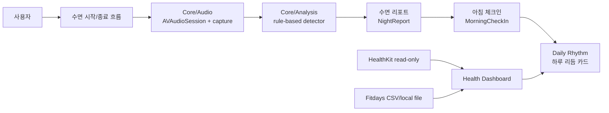

# New Developer Handoff

NightBreath / 밤숨 프로젝트를 새 개발자가 인수받아 안전하게 작업을 시작하기 위한 문서입니다. 이 폴더는 제품 방향, 코드 구조, 개발 환경, 잔여 이슈, QA/release 기준을 한 번에 따라갈 수 있게 나눠 둡니다.

## 빠른 요약

| 항목 | 현재 기준 |
| --- | --- |
| 제품 | iPhone 온디바이스 수면 소리 리포트 앱에서 개인 건강 리듬 리포트 앱으로 확장 |
| 앱 이름 | 한국어: 밤숨 / 영어: NightBreath |
| 현재 개발선 | `v1.1.0` 안정화 및 release candidate 준비 |
| 핵심 원칙 | 온디바이스, 로컬 저장, HealthKit read-only, Fitdays local import only |
| 금지선 | 서버 업로드, 클라우드 처리, 외부 분석 SDK, HealthKit write, 의료 진단 문구 |
| 현재 남은 큰 작업 | Sleep UX, Health/Fitdays 사용성, Daily Rhythm 보강, 전체 QA gate, release evidence |

## 읽는 순서

| 순서 | 문서 | 목적 |
| --- | --- | --- |
| 1 | [Project & Architecture](PROJECT_ARCHITECTURE.md) | 제품 범위, 디렉터리 구조, 주요 데이터 흐름 파악 |
| 2 | [Development & QA](DEVELOPMENT_QA.md) | 로컬 환경, 빌드/테스트 명령, 실기기 QA 기준 확인 |
| 3 | [Roadmap & Remaining Issues](ROADMAP_REMAINING_ISSUES.md) | v1.1.0 잔여 이슈와 다음 작업 우선순위 확인 |
| 4 | [AGENTS.md](../../AGENTS.md) | 반드시 지켜야 할 제품/개인정보/의료 문구/모델 추천 규칙 확인 |
| 5 | [V1.1 Roadmap](../V1_1_ROADMAP.md) | v1.1.0 전체 release gate와 모델 추천 리스트 확인 |

## 제품 화면 지도

아래 이미지는 README용으로 관리되는 현재 앱 화면입니다. 스크린샷 갱신 시 `Tools/Screenshots/validate_screenshot_manifest.sh`와 release approval 검증을 같이 실행해야 합니다.

| Home / Start | Report / Timeline |
| --- | --- |
|  |  |
|  |  |

| Daily Rhythm | Health Dashboard |
| --- | --- |
|  |  |
|  |  |

## 시스템 개요

핵심은 “수면 소리 이벤트와 건강 지표를 한 화면에서 참고용으로 보여주되, 원인/진단/치료를 주장하지 않는다”입니다. 이 기준은 UI 문구, 데이터 모델, 테스트, release 문서까지 동일하게 적용됩니다.

## 첫날 체크리스트

| 체크 | 작업 |
| --- | --- |
|  | `AGENTS.md`를 먼저 읽고 금지선과 모델 추천 기준을 확인합니다. |
|  | `README.md`, `Docs/CURRENT_STATUS.md`, `Docs/NEXT_ISSUES.md`, `Docs/V1_1_ROADMAP.md`를 읽습니다. |
|  | Xcode에서 `SleepSoundApp.xcodeproj`를 열고 앱 타깃과 SwiftPM 패키지 구조를 확인합니다. |
|  | CLI에서 `swift test --no-parallel`을 실행해 현재 테스트 기준선을 확보합니다. |
|  | 실기기 테스트가 필요한 작업인지 먼저 분류합니다. 오디오 캡처, 백그라운드, HealthKit, Fitdays 실제 공유/import는 실기기 확인이 필요합니다. |
|  | 작업 시작 전 추천 모델/추론 수준을 VATester 점수와 상향 규칙으로 명시합니다. |

## 작업 시작 전 금지선

| 금지 항목 | 이유 |
| --- | --- |
| 네트워크 호출, 서버 업로드, 클라우드 동기화 | 온디바이스/로컬 우선 제품 원칙 위반 |
| 외부 분석 SDK, 광고 SDK, 계정 시스템 | 개인정보 보호 정책 및 V1 범위 위반 |
| HealthKit write/custom type 생성 | 현재 앱은 HealthKit read-only만 허용 |
| Fitdays API 직접 연결, reverse engineering | local-only import 원칙 위반 |
| 밤새 원본 오디오 전체 저장 | 기본 개인정보 보호 정책 위반 |
| 의료 진단/치료/확정적 인과 문구 | 웰니스 참고용 앱 범위 위반 |

## 다음 담당자에게 중요한 판단

v1.1.0의 앞선 수면 기록 P0 안정화와 수면 리포트 신뢰도 작업은 통과 기준으로 닫을 수 있습니다. 단, 전체 release candidate는 아직 아닙니다. 남은 작업은 Sleep UX, Health/Fitdays, Daily Rhythm, 자동화/실기기 QA, 문서/evidence, 최종 RC 판단까지 이어집니다.

자세한 우선순위는 [Roadmap & Remaining Issues](ROADMAP_REMAINING_ISSUES.md)를 기준으로 진행합니다.
