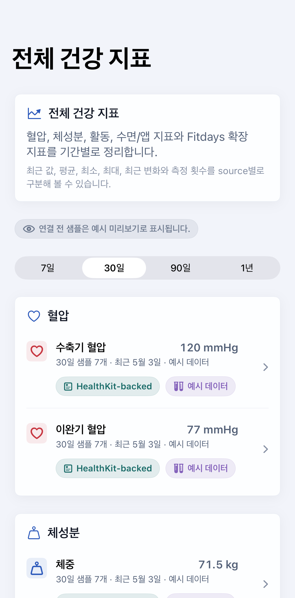
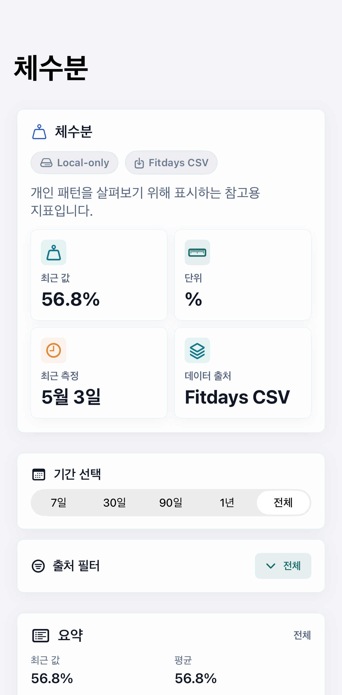
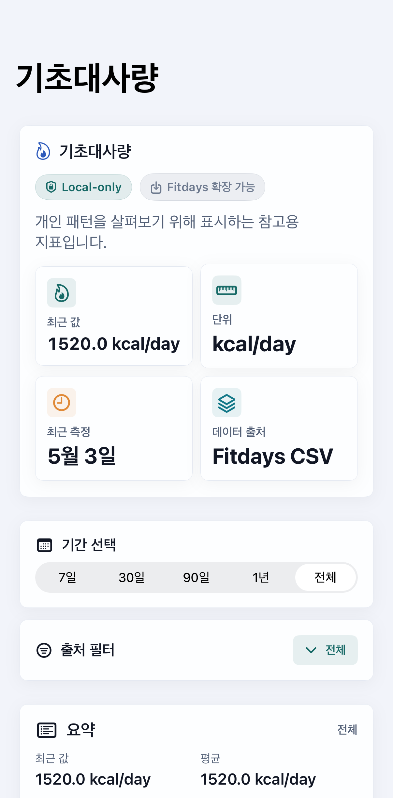
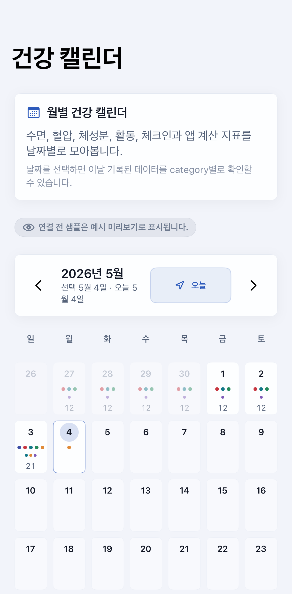
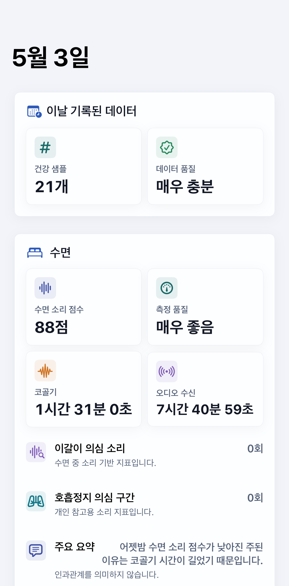
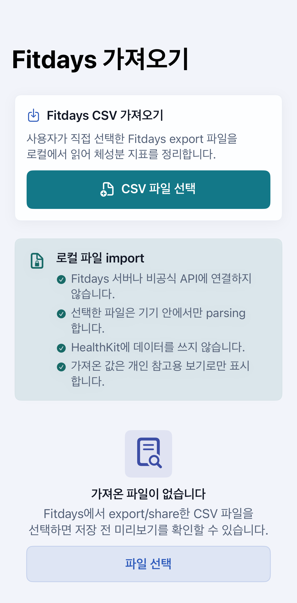
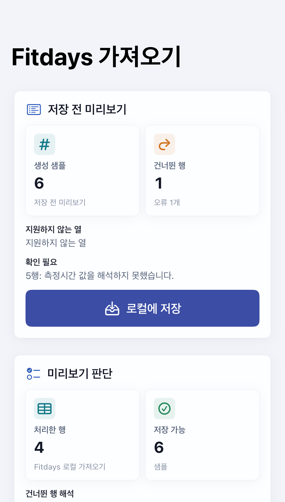
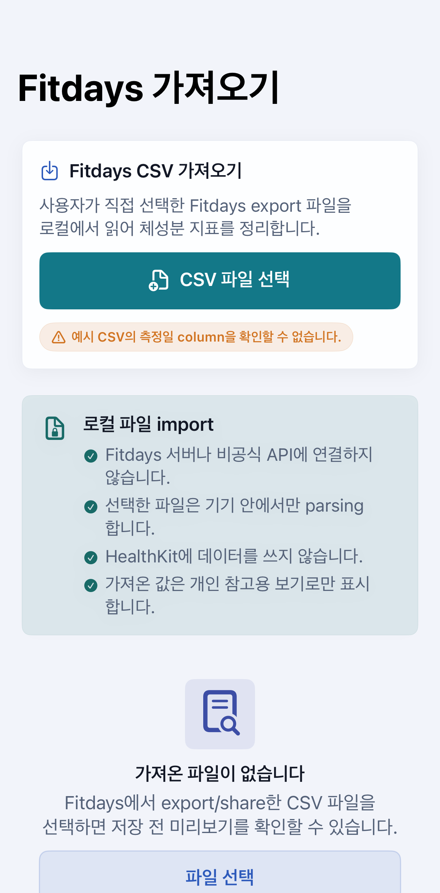

# UI Gallery

이 문서는 NightBreath / 밤숨의 화면별 역할, 표시 데이터, 액션, 개인정보/안전 원칙, screenshot scenario, screenshot 저장 후보를 정리합니다. README에는 대표 화면만 짧게 소개하고, 가능한 UI와 상태별 설명은 이 문서를 기준으로 관리합니다.

## 개요

NightBreath는 수면 중 소리 기반 지표에서 시작해 하루 건강 리듬을 참고용으로 정리하는 온디바이스 앱입니다. UI gallery는 README 대표 screenshot과 아직 pending인 화면 범위를 함께 추적하기 위한 문서입니다.

## Screenshot 원칙

- 실제 screenshot 파일이 없는 화면은 `screenshot pending`으로 표시합니다.
- 실제 파일이 생기기 전에는 README나 문서에 image markdown을 추가하지 않습니다.
- README에는 대표 화면만 싣고, 전체 화면과 edge state는 이 문서에서 관리합니다.
- README 대표 screenshot은 `Docs/Screenshots/README/cropped/`의 crop 버전을 사용합니다.
- README 대표 crop은 status bar, 시간, Dynamic Island 영역만 제거하고 화면 title과 주요 content는 유지합니다.
- 원본 capture는 `Docs/Screenshots/README/`에 보존하며, 상세 gallery screenshot은 화면별 필요에 따라 원본 또는 crop 버전을 구분해 관리합니다.
- App Store 후보 screenshot은 `Docs/APP_RELEASE_GUIDE.md`와 함께 검토합니다.
- Light/Dark screenshot은 같은 예시 state에서 각각 확인하고, 긴 한국어 문구가 잘리지 않는지 봅니다.
- Debug-only 화면은 Release 사용자 screenshot 후보에 포함하지 않습니다.

현재 README 대표 screenshot 8개와 EHM 상세 screenshot은 `iPhone 17 Pro` simulator, DEBUG build, 예시 데이터 상태에서 생성했습니다. 아직 캡처하지 않은 상세 화면과 edge state는 `screenshot pending`으로 유지합니다.

## 예시 데이터 사용 원칙

- 모든 screenshot은 예시 데이터 또는 simulator scenario 기반이어야 합니다.
- 실제 개인 건강 데이터, 실제 HealthKit 데이터, 실제 오디오 파일, 실제 이벤트 오디오 샘플을 사용하지 않습니다.
- Daily Rhythm, Health Dashboard, Cross Metric 화면은 mock/protocol 또는 사용자가 명시적으로 연결한 read-only 흐름을 전제로 문서화합니다.
- screenshot용 샘플 값은 개인 참고용 맥락으로만 표시하고 건강 상태를 단정하지 않습니다.

## 실제 개인 데이터 금지

- 개인 이름, 실제 생년월일, 실제 건강 샘플, 실제 source device serial, 실제 녹음 파일명을 노출하지 않습니다.
- 서버 전송, 자동 공유, 외부 SDK 사용을 암시하지 않습니다.
- 수면 소리 지표와 건강 지표를 함께 보여도 인과관계를 의미하지 않는다는 안내를 유지합니다.
- 모든 건강 관련 화면에는 필요 시 “이 앱은 진단 목적의 의료기기가 아닙니다.” 또는 동등한 안전 문구를 포함합니다.

## Home / Dashboard

| View name | 역할 | 주요 표시 데이터 | 주요 액션 | Privacy / Safety notes | Suggested scenario | Suggested screenshot path | Screenshot | Release 노출 | 관련 문서 |
| --- | --- | --- | --- | --- | --- | --- | --- | --- | --- |
| `HomeDashboardView` | 앱 홈과 최근 리포트 허브 | 최근 수면 리포트, 수면 소리 점수, 측정 품질, Daily Rhythm 진입점 | 수면 시작, 리포트/타임라인/건강/개인정보 진입 | 온디바이스 분석, 서버 전송 없음, 원본 전체 오디오 미저장 안내 | `ScreenshotHomeScenario` | `Docs/Screenshots/README/cropped/home_dashboard_light.png` |  | Release | `Docs/UI_SCREEN_MAP.md`, `Docs/DESIGN_SYSTEM.md` |
| `TrendDashboardView` | 7일/30일/90일 수면 소리 흐름 | 수면 소리 점수, 코골기 시간, 측정 품질 추세 | 기간 선택 | 낮은 측정 품질은 배지와 문장으로 구분 | `ScreenshotHomeScenario` 이후 수동 진입 | `Docs/Screenshots/Home/trend-dashboard.png` | screenshot pending | Release | `Docs/UI_SCREEN_MAP.md` |

## Sleep Flow

| View name | 역할 | 주요 표시 데이터 | 주요 액션 | Privacy / Safety notes | Suggested scenario | Suggested screenshot path | Screenshot | Release 노출 | 관련 문서 |
| --- | --- | --- | --- | --- | --- | --- | --- | --- | --- |
| `SleepStartView` | 오늘 밤 측정 시작 전 준비 | 측정 안내, 기기 배치, 마이크 권한, 이벤트 오디오 샘플 opt-in 상태 | 수면 시작, 배치 가이드, 개인정보 설정 | 원본 전체 오디오는 저장하지 않으며 이벤트 샘플은 opt-in일 때만 저장 | `ScreenshotSleepStartScenario` | `Docs/Screenshots/README/cropped/sleep_start_light.png` |  | Release | `Docs/QA_GUIDE.md` |
| `SleepRecordingView` | 수면 기록 중 상태 | 경과 시간, 실제 오디오 수신/분석 시간, 커버리지, detector backend | 수면 종료 | 수신 시간과 앱 실행 시간을 분리해 표시 | `ScreenshotRecordingScenario` | `Docs/Screenshots/README/recording.png` | screenshot pending | Release | `Docs/QA_GUIDE.md` |
| `SleepReportView` | 아침 수면 소리 리포트 | 수면 소리 점수, 측정 품질, 이벤트 요약, diagnostics, zero-event 안내 | 타임라인 보기, 아침 체크인, 개인정보 설정 | 수면 중 소리 기반 지표이며 진단 목적이 아님 | `ScreenshotSleepReportScenario` | `Docs/Screenshots/README/cropped/sleep_report_light.png` |  | Release | `Docs/UI_SCREEN_MAP.md` |
| `SleepTimelineView` | 수면 이벤트 상세 목록 | 이벤트 타입, 시간, duration, confidence, 색상 legend, 샘플 보유 여부 | 샘플 재생/삭제, feedback 저장 | 샘플은 짧은 이벤트 구간만 opt-in 저장 | `ScreenshotTimelineScenario` | `Docs/Screenshots/README/cropped/sleep_timeline_light.png` |  | Release | `Docs/PRIVACY_STORAGE_AUDIT.md` |
| `MorningCheckInView` | 아침 주관적 컨디션 기록 | 개운함, 피로감, 각성 기억, 메모 | 체크인 저장 | 사용자가 직접 입력한 주관 기록으로 표시 | `ScreenshotMorningBriefScenario`의 예시 상태에서 수동 진입 | `Docs/Screenshots/Sleep/morning-check-in.png` | screenshot pending | Release | `Docs/UI_SCREEN_MAP.md` |

## Daily Rhythm

| View name | 역할 | 주요 표시 데이터 | 주요 액션 | Privacy / Safety notes | Suggested scenario | Suggested screenshot path | Screenshot | Release 노출 | 관련 문서 |
| --- | --- | --- | --- | --- | --- | --- | --- | --- | --- |
| `MorningBriefView` | 오늘 아침 리포트 | 지난밤 요약, 수면 소리 점수, 아침 컨디션, 예시 아침 건강 데이터, 데이터 품질 | 수면 리포트와 Daily Rhythm 흐름 확인 | 개인 참고용 리포트이며 건강 상태를 단정하지 않음 | `ScreenshotMorningBriefScenario` | `Docs/Screenshots/README/cropped/morning_brief_light.png` |  | Release | `Docs/PRODUCT_DIRECTION.md` |
| `DailyRhythmReportView` | 오늘의 리듬 리포트 | 오늘의 리듬 점수, component score, data quality, Daily Insight | 하루 리듬 요약 확인 | 웰니스/개인 참고용 점수이며 인과관계를 의미하지 않음 | `ScreenshotDailyRhythmScenario` | `Docs/Screenshots/README/cropped/daily_rhythm_report_light.png` |  | Release | `Docs/DAILY_RHYTHM_SCORE.md` |
| `EveningCheckInView` | 저녁 컨디션 기록 | 피로도, 스트레스, 기분, 생활 태그, 메모 | 예시/in-memory 체크인 저장 | 생활 태그는 개인 패턴 참고용 | `ScreenshotDailyRhythmScenario` 이후 수동 진입 | `Docs/Screenshots/DailyRhythm/evening-check-in.png` | screenshot pending | Release | `Docs/UI_SCREEN_MAP.md` |
| `DailyHealthCardView` | 하루 리듬 카드 | 날짜, 오늘의 리듬 점수, 핵심 지표, 한 줄 요약 | 카드 UI 확인 | privacy level에 따라 민감 수치 표시를 줄임 | `ScreenshotDailyHealthCardScenario` | `Docs/Screenshots/README/cropped/daily_health_card_light.png` |  | Release | `Docs/DAILY_HEALTH_CARD.md` |
| `DailyHealthCardPreviewView` | 카드 template/privacy 미리보기 | template 선택, privacy level, 예시 카드 미리보기 | template/privacy 전환 | 실제 export/share는 사용자 명시 액션 전까지 없음 | `ScreenshotDailyHealthCardScenario` | `Docs/Screenshots/README/cropped/daily_health_card_light.png` |  | Release | `Docs/DAILY_HEALTH_CARD.md` |

## Health Dashboard

| View name | 역할 | 주요 표시 데이터 | 주요 액션 | Privacy / Safety notes | Suggested scenario | Suggested screenshot path | Screenshot | Release 노출 | 관련 문서 |
| --- | --- | --- | --- | --- | --- | --- | --- | --- | --- |
| `HealthDashboardView` | 건강 데이터 허브 | read-only 연결 상태, 최근 건강 지표, source, 하위 dashboard 진입점 | 건강 데이터 연결, 혈압/체성분/교차 보기 진입 | HealthKit read-only, 서버 전송 없음, 권한 거부 시 수면 기능 유지 | `ScreenshotHealthDashboardScenario` | `Docs/Screenshots/README/cropped/health_dashboard_light.png` |  | Release | `Docs/HEALTH_DATA_GUIDE.md` |
| `HealthMetricsOverviewView` | 전체 건강 지표 통계/그래프 허브 | HealthKit-backed 지표, Fitdays local-only 지표, 기간별 최근값/평균/변화, source | 기간 선택, metric detail 진입 | source type을 구분하고 수치 해석을 단정하지 않음 | `ScreenshotHealthMetricsOverviewScenario` | `Docs/Screenshots/Health/cropped/health_metrics_overview_light.png` |  | Release | `Docs/HEALTH_DATA_GUIDE.md` |
| `MetricDetailView` | metric 하나의 상세 탐색 | metric 설명, 최근 값, 단위, 기간/source filter, 그래프, 통계, raw 샘플 목록 | 기간 선택, source filter, 샘플 확인 | HealthKit-backed/local-only 설명을 구분하고 개인 참고용으로 표시 | `ScreenshotMetricDetailScenario` | `Docs/Screenshots/Health/cropped/metric_detail_body_water_light.png` |  | Release | `Docs/HEALTH_DATA_GUIDE.md` |
| `MetricDetailView` local-only 예시 | Fitdays 확장 local-only metric 상세 예시 | 기초대사량 설명, source filter, 기간별 그래프, raw 샘플 목록 | 기간 선택, source filter, 샘플 확인 | HealthKit 표준 지표가 아닌 local-only sample임을 명확히 표시 | `ScreenshotLocalOnlyMetricScenario` | `Docs/Screenshots/Health/cropped/metric_detail_basal_metabolic_rate_light.png` |  | Release | `Docs/HEALTH_DATA_GUIDE.md` |
| `HealthCalendarView` | 월 단위 건강 캘린더 | 날짜별 수면/혈압/체성분/활동/check-in dot, 샘플 수, data quality | 이전/다음 월, 오늘 이동, 날짜 선택 | 같은 날짜 데이터가 인과관계를 의미하지 않음을 안내 | `ScreenshotHealthCalendarScenario` | `Docs/Screenshots/Health/cropped/health_calendar_light.png` |  | Release | `Docs/HEALTH_DATA_GUIDE.md` |
| `DailyMeasurementDetailView` | 날짜별 전체 데이터 상세 | 수면, 아침/저녁 체크인, 혈압, 체성분, Fitdays 확장, 활동, 앱 계산 지표, source | metric detail 진입 | 날짜별 묶음은 개인 참고용이며 source를 함께 표시 | `ScreenshotDailyMeasurementDetailScenario` | `Docs/Screenshots/Health/cropped/daily_measurement_detail_light.png` |  | Release | `Docs/HEALTH_DATA_GUIDE.md` |
| `FitdaysImportView` | Fitdays export file 가져오기 | 파일 선택 상태, preview, imported/skipped/error row count, unknown column | 파일 선택, preview 확인, 로컬 저장 | 사용자가 직접 선택한 로컬 파일만 읽고 원격 연결 없음 | `ScreenshotFitdaysImportScenario` | `Docs/Screenshots/Health/cropped/fitdays_import_light.png` |  | Release | `Docs/HEALTH_DATA_GUIDE.md` |
| `BloodPressureDashboardView` | 혈압 데이터 보기 | 최근 수축기/이완기 혈압, 측정 시각, sourceName, 7일/30일/90일 추세 | 기간 선택 | 수치를 상태 판정으로 표현하지 않음 | `ScreenshotHealthDashboardScenario` 이후 수동 진입 | `Docs/Screenshots/Health/blood-pressure-dashboard.png` | screenshot pending | Release | `Docs/HEALTH_DATA_GUIDE.md` |
| `BodyCompositionDashboardView` | 체중/체성분 데이터 보기 | 체중, 체지방률, BMI, 제지방량, sourceName, 추세 | 기간 선택 | 개인 참고용 데이터로만 표시 | `ScreenshotHealthDashboardScenario` 이후 수동 진입 | `Docs/Screenshots/Health/body-composition-dashboard.png` | screenshot pending | Release | `Docs/HEALTH_DATA_GUIDE.md` |
| `CrossMetricDashboardView` | 수면 소리 지표와 건강 지표 참고용 비교 | 수면 지표, 건강 지표, 날짜별 매칭, 샘플 수, sourceName | 비교 항목/기간 선택 | 데이터가 부족하면 분석하지 않고 인과관계를 의미하지 않는다고 안내 | `ScreenshotHealthDashboardScenario` 이후 수동 진입 | `Docs/Screenshots/Health/cross-metric-dashboard.png` | screenshot pending | Release | `Docs/HEALTH_DATA_GUIDE.md` |

## Privacy / Settings

| View name | 역할 | 주요 표시 데이터 | 주요 액션 | Privacy / Safety notes | Suggested scenario | Suggested screenshot path | Screenshot | Release 노출 | 관련 문서 |
| --- | --- | --- | --- | --- | --- | --- | --- | --- | --- |
| `PrivacySettingsView` | 로컬 저장과 개인정보 설정 | 이벤트 오디오 샘플 opt-in, 저장량, orphan 샘플, HealthKit read-only 설명 | 샘플 토글, 삭제, orphan 정리 | 서버 전송 없음, HealthKit 쓰기 없음, 전체 밤 원본 오디오 미저장 | `ScreenshotPrivacyScenario` | `Docs/Screenshots/Privacy/privacy-settings.png` | screenshot pending | Release | `Docs/PRIVACY_STORAGE_AUDIT.md` |
| `DevicePlacementGuideView` | iPhone 배치와 캘리브레이션 안내 | 배치 원칙, 충전, 마이크 가림 방지, 30초 캘리브레이션 | 캘리브레이션 실행 | 측정 품질을 높이기 위한 안내이며 결과를 단정하지 않음 | `ScreenshotSleepStartScenario` 이후 수동 진입 | `Docs/Screenshots/Privacy/device-placement-guide.png` | screenshot pending | Release | `Docs/QA_GUIDE.md` |
| `OnboardingView` | 첫 사용 안내 | 온디바이스 분석, 개인정보 원칙, 이벤트 샘플 opt-in | 시작하기 | 초기 안내에서 서버 전송 없음과 원본 전체 오디오 미저장을 명확히 표시 | 수동 onboarding reset | `Docs/Screenshots/Privacy/onboarding.png` | screenshot pending | Release | `Docs/ONBOARDING_ILLUSTRATION_GUIDE.md` |
| `CalibrationView` | 30초 입력 확인 | 입력 level, ambient baseline, calibration result | 캘리브레이션 시작/완료 | 마이크 입력 품질 확인용이며 건강 상태 해석이 아님 | `ScreenshotSleepStartScenario` 이후 수동 진입 | `Docs/Screenshots/Privacy/calibration.png` | screenshot pending | Release | `Docs/UI_SCREEN_MAP.md` |

## Empty / Edge States

| View name | 역할 | 주요 표시 데이터 | 주요 액션 | Privacy / Safety notes | Suggested scenario | Suggested screenshot path | Screenshot | Release 노출 | 관련 문서 |
| --- | --- | --- | --- | --- | --- | --- | --- | --- | --- |
| Report empty state | 수면 리포트 없음 | 수면 기록 후 리포트 생성 안내 | 수면 시작 | 예시 state로만 문서화 | 수동 empty repository state | `Docs/Screenshots/EdgeStates/report-empty.png` | screenshot pending | Release | `Docs/UI_SCREEN_MAP.md` |
| Timeline empty state | detector 기준 통과 이벤트 없음 | 이벤트가 없는 이유와 zero-event 안내 | 리포트로 돌아가기 | 이벤트 없음은 특정 건강 상태 해석이 아님 | `ScreenshotZeroEventScenario` | `Docs/Screenshots/EdgeStates/zero-event-report.png` | screenshot pending | Release | `Docs/QA_GUIDE.md` |
| Low audio coverage state | 낮은 측정 품질 | 오디오 커버리지, 제한 안내 | 재측정 안내 확인 | 색상만으로 표시하지 않고 배지/문장 병행 | `ScreenshotLowCoverageScenario` | `Docs/Screenshots/EdgeStates/low-coverage-report.png` | screenshot pending | Release | `Docs/QA_GUIDE.md` |
| Health permission empty state | 건강 데이터 권한 없음 | read-only 연결 필요 안내 | 건강 데이터 연결 | 권한 거부 시 수면 기능은 계속 사용 가능 | `ScreenshotHealthDashboardScenario` 이후 권한 없음 state | `Docs/Screenshots/EdgeStates/health-permission-empty.png` | screenshot pending | Release | `Docs/HEALTH_DATA_GUIDE.md` |
| Fitdays import empty state | 가져오기 전 상태 | 파일 선택 안내, 로컬 import 원칙 | 파일 선택 | 실제 개인 CSV를 screenshot에 사용하지 않음 | `ScreenshotFitdaysImportScenario` | `Docs/Screenshots/Health/cropped/fitdays_import_light.png` |  | Release | `Docs/HEALTH_DATA_GUIDE.md` |
| Fitdays import result state | 가져오기 미리보기/결과 | imported 샘플 수, skipped rows, unknown columns, errors | 저장 또는 상태 확인 | synthetic fixture 또는 예시 state만 사용 | `ScreenshotFitdaysImportResultScenario` | `Docs/Screenshots/Health/cropped/fitdays_import_result_light.png` |  | Release | `Docs/HEALTH_DATA_GUIDE.md` |
| Fitdays import error state | invalid CSV 처리 | 오류 row, 건너뛴 row, 알 수 없는 column | 파일 다시 선택 | 실제 개인 CSV 파일명이나 경로를 노출하지 않음 | `ScreenshotImportErrorScenario` | `Docs/Screenshots/Health/cropped/fitdays_import_error_light.png` |  | Release | `Docs/HEALTH_DATA_GUIDE.md` |
| Metric detail empty state | 특정 기간/source 샘플 없음 | empty 안내, 기간/source 변경 제안 | 기간 변경, source filter 변경 | 데이터 부족을 상태 해석으로 바꾸지 않음 | `ScreenshotMetricDetailScenario`에서 source filter 수동 변경 | `Docs/Screenshots/EdgeStates/metric-detail-empty.png` | screenshot pending | Release | `Docs/HEALTH_DATA_GUIDE.md` |
| Cross metric insufficient state | 비교 가능한 데이터 부족 | matched 샘플 수, 제한 안내 | 기간/항목 변경 | 데이터가 부족하면 패턴 요약을 생성하지 않음 | `ScreenshotHealthDashboardScenario` 이후 수동 진입 | `Docs/Screenshots/EdgeStates/cross-metric-insufficient.png` | screenshot pending | Release | `Docs/HEALTH_DATA_GUIDE.md` |
| Event audio storage off state | 이벤트 샘플 저장 꺼짐 | opt-in 상태, 저장 없음 안내 | 개인정보 설정 확인 | 사용자가 켜지 않으면 샘플을 저장하지 않음 | `ScreenshotEventAudioStorageOffScenario` | `Docs/Screenshots/EdgeStates/event-audio-storage-off.png` | screenshot pending | Release | `Docs/PRIVACY_STORAGE_AUDIT.md` |

## Debug-only Screens

| View name | 역할 | 주요 표시 데이터 | 주요 액션 | Privacy / Safety notes | Suggested scenario | Suggested screenshot path | Screenshot | Release 노출 | 관련 문서 |
| --- | --- | --- | --- | --- | --- | --- | --- | --- | --- |
| `DatasetReplayView` | 로컬/synthetic audio replay 검증 | replay 상태, diagnostics, 후보/이벤트 수 | replay 실행 | 개인 오디오 파일은 repo나 screenshot에 포함하지 않음 | `ScreenshotDebugScenario` 이후 수동 진입 | `Docs/Screenshots/Debug/dataset-replay.png` | screenshot pending | DEBUG only | `Docs/DATASET_REPLAY.md` |
| `DetectorTuningView` | detector profile 확인 | backend, tuning profile, fallback, threshold | profile 선택 | 결과는 개발 검증용이며 사용자 판단 문구로 쓰지 않음 | `ScreenshotDebugScenario` | `Docs/Screenshots/Debug/detector-tuning.png` | screenshot pending | DEBUG only | `Docs/DETECTOR_TUNING.md` |
| `SimulatorScenarioView` | 예시 scenario 적용 | scenario 목록, screenshot preset, 적용 상태, 화면 진입 링크 | scenario 적용/해제 | screenshot과 UI QA는 예시 데이터 기반 | `ScreenshotDebugScenario` 이후 현재 화면 | `Docs/Screenshots/Debug/simulator-scenario.png` | screenshot pending | DEBUG only | `Docs/QA_GUIDE.md` |
| `AudioDebugView` | 오디오 입력/debug output 확인 | RMS, energy, detector output | 입력 상태 확인 | 원본 전체 오디오 저장을 암시하지 않음 | `ScreenshotDebugScenario` 이후 수동 진입 | `Docs/Screenshots/Debug/audio-debug.png` | screenshot pending | DEBUG only | `Docs/UI_SCREEN_MAP.md` |
| `SampleCaptureView` | 짧은 개발용 sample capture | sample count, 저장 경로, capture 상태 | 짧은 샘플 캡처 | 실제 screenshot에는 개인 오디오 파일명이나 샘플 내용을 노출하지 않음 | `ScreenshotDebugScenario` 이후 수동 진입 | `Docs/Screenshots/Debug/sample-capture.png` | screenshot pending | DEBUG only | `Docs/QA_GUIDE.md` |
