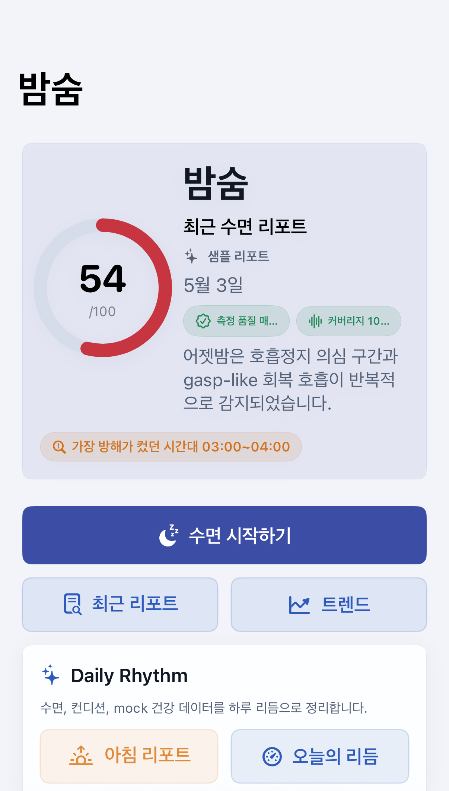
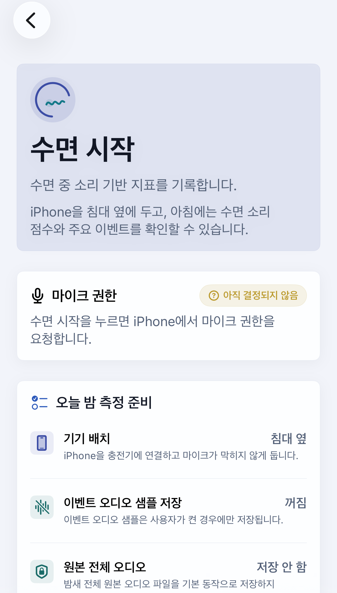
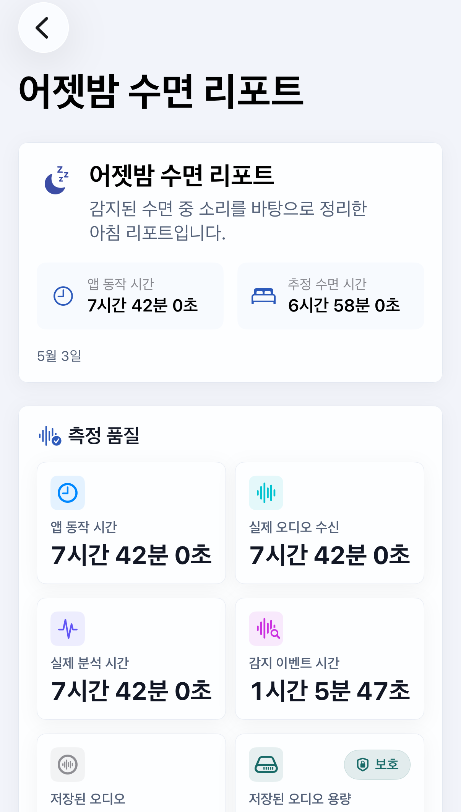
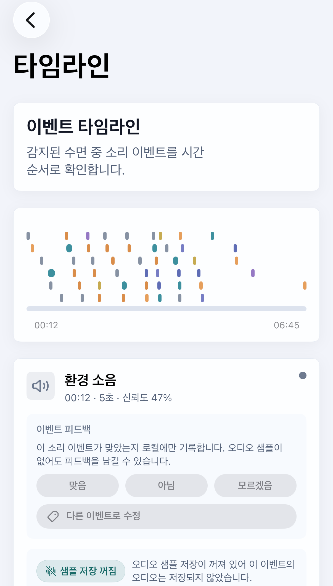
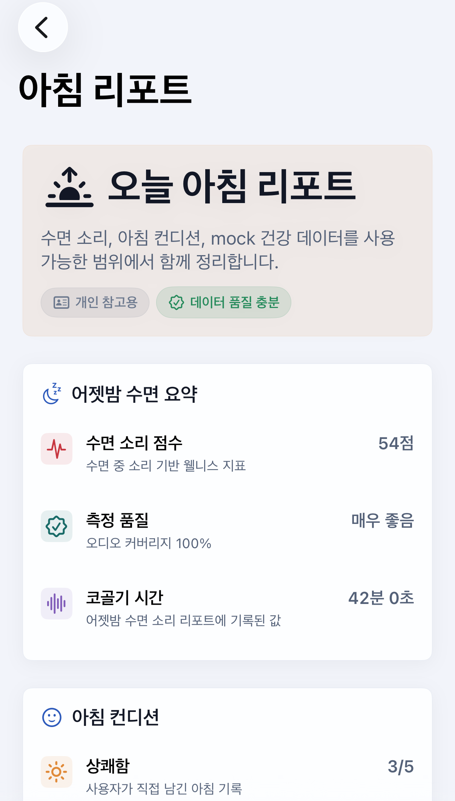
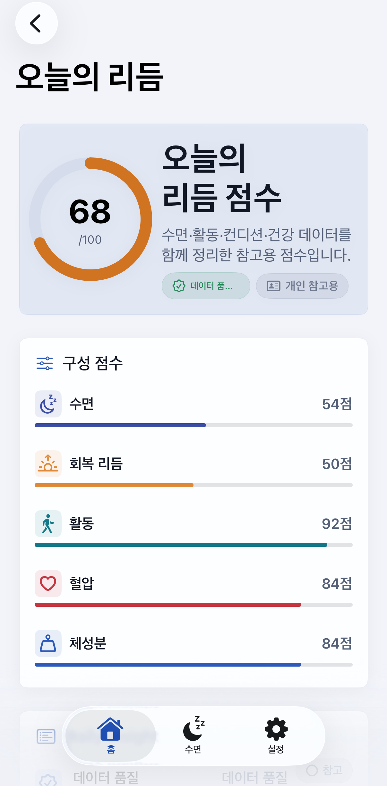
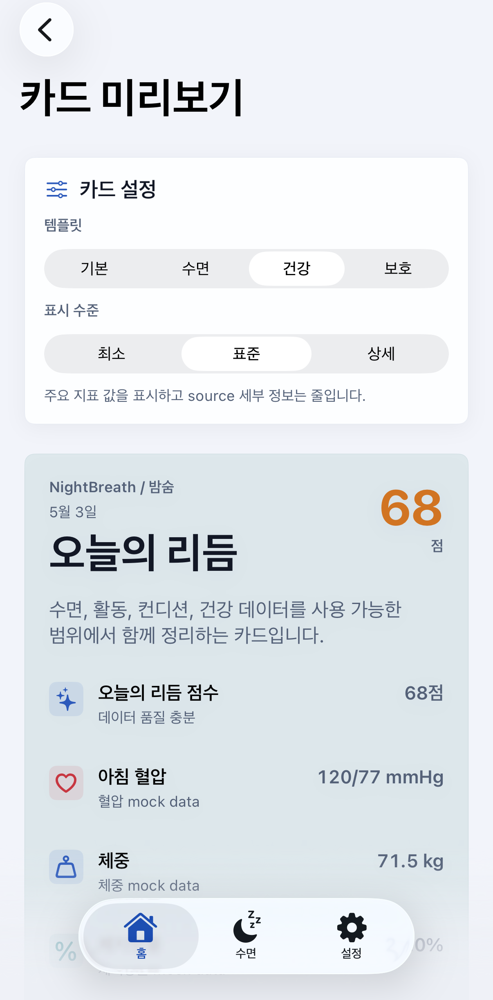
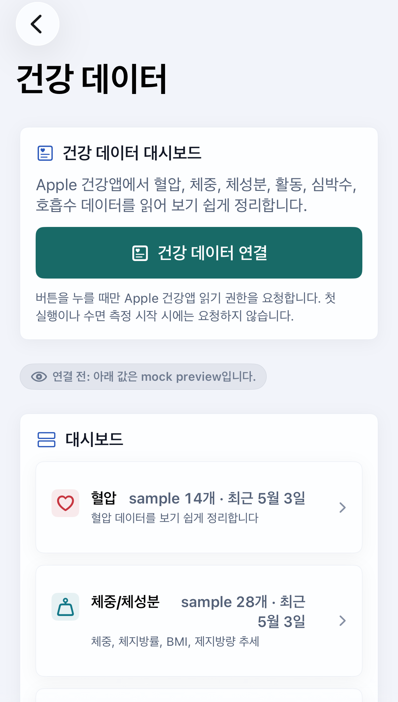

# NightBreath / 밤숨

밤숨(NightBreath)은 iPhone 온디바이스 기반 개인 건강 리듬 리포트 앱입니다.

NightBreath / 밤숨은 수면 중 소리 기반 리포트에서 시작해, 수면·혈압·체중·체성분·활동·컨디션 데이터를 한곳에서 볼 수 있는 온디바이스 개인 건강 리듬 리포트 앱으로 확장됩니다.

사용자가 자기 전 수면 측정을 시작하면 앱은 iPhone 내부에서 마이크 입력을 처리하고, 아침에 감지된 수면 중 소리 이벤트를 바탕으로 웰니스 성격의 `수면 소리 점수`와 리포트를 보여줍니다. 이후 방향은 이 아침 리포트를 하루 리듬의 시작점으로 삼고, 건강 데이터와 컨디션 기록을 함께 정리하는 `오늘의 리듬 점수`, `하루 리듬 카드`, 건강 대시보드로 넓혀 갑니다.

이 앱은 질병을 확정하거나 치료 판단을 제공하지 않습니다. 리포트는 수면 중 소리 기반 참고 지표입니다.

## 앱 이름

- 한국어 표시 이름: 밤숨
- 영어 프로젝트 / 브랜드 이름: NightBreath
- 한국어 부제: 수면 소리 리포트
- 영어 부제: Sleep Sound Report

제품 확장 방향:

- 한국어 방향: 온디바이스 개인 건강 리듬 리포트
- 영어 방향: On-device Personal Health Rhythm Report
- 핵심 문구: 오늘의 리듬 점수, 아침 리포트, 하루 리듬 카드, 회복 리듬

자세한 제품 방향은 `Docs/PRODUCT_DIRECTION.md`를 참고합니다.

## NightBreath / 밤숨의 확장 방향

NightBreath는 수면 소리 리포트에서 출발해, 아침에 확인하는 리포트와 하루 동안의 컨디션/활동/예시 건강 데이터를 연결하는 Daily Rhythm 경험으로 확장합니다.

- 수면 소리 리포트: 수면 중 소리 이벤트, 수면 소리 점수, 측정 품질, 이벤트 타임라인을 온디바이스로 정리합니다.
- 아침 리포트: 지난밤 수면 요약, 아침 컨디션, 예시 혈압/체중/체성분 데이터를 같은 날짜의 시작점으로 보여줍니다.
- 오늘의 리듬 점수: 수면, 회복 리듬, 활동, 혈압, 체성분 component를 데이터 품질과 함께 요약하는 웰니스/개인 참고용 점수입니다.
- 하루 리듬 카드: 오늘의 리듬 점수와 핵심 지표를 이미지 카드 형태로 보여줄 수 있는 레이아웃이며, privacy level에 따라 민감 수치 표시를 줄일 수 있습니다.
- 예시 건강 데이터 architecture: `HealthDataServiceProtocol`, `MockHealthDataService`, `DailyHealthSnapshotBuilder`로 Omron Connect/Fitdays/Apple Health 예시 source를 분리합니다.
- HealthKit read-only 연동: 사용자가 건강 데이터 대시보드에서 연결을 선택할 때만 Apple 건강앱 읽기 권한을 요청합니다.
- Extended Health Metrics: HealthKit 표준 지표와 Fitdays CSV/local-only 확장 지표를 `UnifiedHealthMetricSample`로 함께 표현합니다.
- Fitdays CSV/import: 사용자가 직접 선택한 export 파일만 로컬에서 읽고, Fitdays 원격 서비스나 비공식 연결은 사용하지 않습니다.
- 건강 지표 통계/그래프: 7일/30일/90일/1년/전체 기간의 metric별 흐름, source, raw 샘플 목록을 확인합니다.
- 월 건강 캘린더: 데이터가 있는 날짜를 표시하고, 날짜별 수면/건강/check-in/앱 계산 지표를 category별로 봅니다.
- 진단 목적 아님: 리포트는 개인 패턴을 살펴보기 위한 참고용 보기이며, 특정 건강 상태를 단정하거나 조치 판단을 제공하지 않습니다.

## 현재 개발 전략

NightBreath는 Simulator-first 방식으로 개발합니다.

반복 개발 중에는 실제 iPhone 테스트를 매번 수행하지 않습니다. 대부분의 detector, 리포트, 저장소, privacy 회귀 검증은 다음 도구로 먼저 확인합니다.

- Swift unit tests
- synthetic audio tests
- Dataset Replay
- Offline Evaluation
- Simulator QA scenarios

실제 iPhone 테스트는 마이크 캡처, 화면 잠금/백그라운드 녹음, 배터리/발열, 장시간 overnight 안정성처럼 Simulator가 대체할 수 없는 시점에 수행합니다.

관련 문서:

- `Docs/DEVELOPMENT_WORKFLOW.md`
- `Docs/QA_GUIDE.md`
- `Docs/DATASET_REPLAY.md`
- `Docs/DETECTOR_TUNING.md`
- `Docs/PRIVACY_STORAGE_AUDIT.md`

## V1 기능

현재 V1 프로토타입은 정확도 확정보다 앱 구조, 개인정보 원칙, 테스트 가능한 분석 pipeline을 우선합니다.

- SwiftUI 기반 앱 구조
- 수면 시작/종료 흐름
- 마이크 권한 요청
- AVAudioEngine 기반 오디오 chunk 캡처
- 앱 세션 시간과 실제 오디오 수신 시간 분리
- rule-based 수면 소리 감지 placeholder
- detector backend protocol과 Core ML adapter placeholder
- detector diagnostics
- zero-event analysis
- 수면 이벤트 집계
- 수면 소리 점수 계산
- 수면 리포트 UI
- 수면 이벤트 타임라인
- 최근 7일/30일/90일 수면 트렌드 UI
- 아침 컨디션 체크인
- 로컬 저장소 기반 세션/이벤트/리포트/체크인 저장
- 이벤트 오디오 샘플 opt-in 저장, 재생, 삭제
- 이벤트별 사용자 피드백 저장/삭제/export 구조
- 저장된 이벤트 오디오 용량 표시
- orphan 이벤트 오디오 샘플 정리
- 온보딩, iPhone 배치 가이드, 30초 캘리브레이션 flow
- DEBUG 오디오 디버그 화면
- DEBUG 짧은 샘플 수집 화면
- Dataset Replay
- Offline Evaluation
- Snore ML v0 training/변환 준비 도구
- multiclass event classifier 준비 도구
- Simulator QA scenarios
- NightBreath 전용 디자인 시스템
- `HealthDataServiceProtocol`과 `MockHealthDataService` 기반 예시 건강 데이터 구조
- `RealHealthKitService` 기반 read-only adapter
- 예시 미리보기와 HealthKit read-only 연결을 함께 지원하는 건강 데이터 대시보드
- 혈압/체중/체성분 건강 데이터 dashboard
- 수면 소리 지표와 건강 지표 교차 보기
- HealthKit 표준 지표와 Fitdays extended local-only 지표를 함께 표현하는 metric catalog
- Fitdays CSV 또는 structured export import flow
- 전체 건강 지표 통계/그래프 화면
- 월 건강 캘린더와 날짜별 전체 데이터 상세 화면
- metric별 상세 통계/그래프/source filter/raw 샘플 목록 화면
- Daily Rhythm 도메인 모델
- Mock Health Data Service
- Daily Rhythm Score 계산기
- Daily Insight 생성기
- Morning Brief 화면
- Daily Rhythm Report 화면
- Evening Check-in 화면
- Daily Health Card 화면과 카드 template/privacy level 구조
- README 대표 screenshot section과 UI Gallery
- Daily Rhythm 확장을 위한 문서화와 제품 원칙

## 주요 화면

NightBreath의 주요 UI는 `Core/Design`의 NightBreath 디자인 시스템을 기반으로 정리되어 있습니다. 자세한 컴포넌트 설명은 `Docs/DESIGN_SYSTEM.md`, 화면별 역할과 navigation 구조는 `Docs/UI_SCREEN_MAP.md`, 화면별 screenshot 상태는 `Docs/UI_GALLERY.md`를 참고합니다.

- 홈 대시보드: 최근 수면 리포트, 수면 소리 점수, 측정 품질, 수면 시작 CTA, 온디바이스 분석 안내를 보여줍니다.
- 수면 시작: 오늘 밤 측정 안내, 기기 배치, 마이크 권한, 이벤트 오디오 샘플 저장 상태를 확인합니다.
- 수면 녹음 중: 세션 경과 시간, 실제 오디오 수신/분석 시간, 녹음 커버리지, detector backend, 수면 종료 버튼을 표시합니다.
- 수면 리포트와 이벤트 타임라인: 주요 수면 소리 지표, detector diagnostics 요약, zero-event analysis, 이벤트별 시간/재생/삭제 상태를 보여줍니다.
- 아침 컨디션 체크인: 개운함, 피로감, 기억나는 각성, 메모를 사용자의 주관적 기록으로 저장합니다.
- 아침 리포트: 수면 소리 요약, 아침 컨디션, 예시 혈압/체중/체성분 데이터, 데이터 품질을 함께 보여줍니다.
- 오늘의 리듬 리포트: 오늘의 리듬 점수, component score, data quality, Daily Insight 목록을 참고용으로 보여줍니다.
- 저녁 체크인: 하루 피로도, 스트레스, optional 기분, 생활 태그, 메모를 `EveningCheckIn` 형태로 기록할 준비를 합니다.
- 하루 리듬 카드: template과 privacy level에 따라 오늘의 리듬 점수와 핵심 지표를 이미지 카드 형태로 미리 봅니다.
- 개인정보 설정: 이벤트 오디오 샘플 opt-in, 저장 용량, orphan 샘플 정리, 전체 삭제, 서버 전송 없음 안내를 제공합니다.
- 기기 배치 가이드: 침대 옆 iPhone 배치, 마이크 가림 방지, 충전 연결, 30초 캘리브레이션 진입을 안내합니다.
- 건강 대시보드: 예시 미리보기와 HealthKit read-only adapter, Fitdays CSV import, 전체 건강 지표, 월 캘린더, 혈압/체성분/교차 보기 진입점을 제공합니다.
- 전체 건강 지표: HealthKit-backed 지표, Fitdays local-only 지표, 수동/앱 계산 지표를 category별로 묶고 기간별 통계와 그래프로 보여줍니다.
- 월 건강 캘린더: 수면, 혈압, 체성분, 활동, 체크인, 앱 계산 지표가 있는 날짜를 표시하고 날짜별 상세 보기로 이동합니다.
- Metric Detail: 특정 health metric 하나의 최근 값, 통계, 그래프, source filter, raw 샘플 목록을 개인 참고용으로 보여줍니다.
- Debug / Dataset Replay 화면: DEBUG 빌드에서만 노출되며 detector tuning, dataset replay, simulator scenario, 샘플 캡처 검증에 사용합니다.

## 주요 화면 미리보기

아래 이미지는 예시 데이터와 simulator scenario로 생성된 화면입니다.

자세한 화면별 설명은 `Docs/UI_GALLERY.md`를 참고하세요.

스크린샷은 예시 데이터와 simulator scenario를 사용하며 실제 개인 건강 데이터나 실제 오디오 데이터는 포함하지 않습니다.

DEBUG 빌드의 simulator screenshot preset과 캡처 절차는 `Tools/Screenshots/README.md`를 기준으로 합니다.

| 홈 대시보드 | 수면 시작 |
| --- | --- |
|  |  |

| 수면 리포트 | 이벤트 타임라인 |
| --- | --- |
|  |  |

| 아침 리포트 | 오늘의 리듬 |
| --- | --- |
|  |  |

| 하루 리듬 카드 | 건강 데이터 대시보드 |
| --- | --- |
|  |  |

## V1에서 하지 않는 것

- HealthKit 쓰기
- 앱 첫 실행 또는 수면 측정 시작 시 HealthKit 권한 요청
- HealthKit에 수면 소리 점수나 앱 데이터를 기록
- Fitdays 원격 서비스 직접 연결
- 비공식 연결 방식 사용
- Apple Watch 연동
- 서버 업로드
- 클라우드 처리 또는 동기화
- 외부 API 호출
- 외부 분석 SDK
- 광고 SDK
- 계정/로그인 시스템
- 실제 `.mlmodel` 번들 적용
- 모델 성능 확정 검증
- 전체 밤 원본 오디오 파일 저장
- 이벤트와 무관한 연속 오디오 보관
- 잠꼬대/말소리 텍스트 변환
- 임상 지표 산출
- 질환명 확정 또는 의료적 판정

## 주요 표현 원칙

앱 문구는 수면 중 소리 기반 웰니스 지표로 제한합니다.

사용하는 표현:

- 코골기
- 이갈이 의심 소리
- 호흡정지 의심 구간
- gasp-like 회복 호흡
- 기침 의심 소리
- 환경 소음
- 움직임 의심 소리
- 각성 의심 구간
- 수면 소리 점수

피하는 방향:

- 질환명을 확정하는 표현
- 임상 지표를 정확히 산출한다는 표현
- 이갈이를 확정하는 표현
- 치료 판단처럼 읽히는 표현
- 사용자의 건강 상태를 단정하는 표현

Daily Rhythm 확장에서도 같은 원칙을 유지합니다.

사용하는 표현:

- 오늘의 리듬 점수
- 회복 리듬
- 아침 리포트
- 하루 리듬 카드
- 개인 패턴을 살펴보기 위한 참고용 보기

피하는 방향:

- 건강 데이터를 질병 여부로 해석하는 표현
- 특정 수면 소리 이벤트와 혈압/체중/체성분 변화 사이의 인과관계를 단정하는 표현
- 치료나 의학적 조치를 직접 권하는 표현

## 프로젝트 구조

```text
SleepSoundApp
- App
  - SleepSoundApp.swift
  - AppState.swift
  - Formatting.swift

- Features
  - Sleep
    - SleepStartView.swift
    - SleepRecordingView.swift
    - SleepReportView.swift
    - SleepTimelineView.swift
    - MorningCheckInView.swift
  - DailyRhythm
    - MorningBriefView.swift
    - DailyRhythmReportView.swift
    - EveningCheckInView.swift
    - DailyHealthCardView.swift
    - DailyHealthCardPreviewView.swift
  - Dashboard
    - HomeDashboardView.swift
    - TrendChartView.swift
    - TrendDashboardView.swift
    - HealthDashboardView.swift
    - BloodPressureDashboardView.swift
    - BodyCompositionDashboardView.swift
    - CrossMetricDashboardView.swift
    - HealthMetricChartView.swift
    - HealthMetricsOverviewView.swift
    - HealthCalendarView.swift
    - FitdaysImportView.swift
  - Onboarding
    - OnboardingView.swift
    - CalibrationView.swift
  - Settings
    - PrivacySettingsView.swift
    - DevicePlacementGuideView.swift
    - AudioDebugView.swift
    - DetectorTuningView.swift
    - DatasetReplayView.swift
    - SimulatorScenarioView.swift
    - SampleCaptureView.swift

- Core
  - Audio
  - Analysis
  - Design
  - DailyRhythm
  - FutureHealth
  - Models
  - Privacy
  - Storage

Tests
Tools
Docs
```

## 빌드와 테스트

Xcode에서 열기:

```bash
open SleepSoundApp.xcodeproj
```

SwiftPM 테스트:

```bash
DEVELOPER_DIR=/Applications/Xcode.app/Contents/Developer \
swift test --no-parallel
```

iOS generic Debug build:

```bash
DEVELOPER_DIR=/Applications/Xcode.app/Contents/Developer \
xcodebuild \
  -project SleepSoundApp.xcodeproj \
  -scheme SleepSoundApp \
  -configuration Debug \
  -destination generic/platform=iOS \
  -derivedDataPath .derivedData \
  CODE_SIGNING_ALLOWED=NO \
  build
```

## Simulator-first QA

DEBUG 빌드에서 `설정 > 개발 > Simulator QA Scenario`로 들어가 예시 수면 세션을 적용할 수 있습니다.

지원 scenario:

- QuietNight
- SnoreHeavyNight
- NoiseHeavyNight
- CoughGaspNight
- BruxismLikeNight
- ZeroEventButGoodAudioCoverage
- ZeroEventBecauseNoAudioReceived
- LowAudioCoverageNight
- EventAudioStorageOff
- EventAudioStorageOnWithSamples
- OrphanSamplesPresent

이 화면에서 홈, 리포트, 타임라인, 개인정보 화면을 열어 다음 상태를 확인합니다.

- 수면 소리 점수
- 측정 품질
- 실제 오디오 수신 시간
- 이벤트 수
- 이벤트 오디오 샘플 저장 ON/OFF
- 저장 용량과 orphan 샘플 상태
- detector diagnostic summary
- zero-event analysis

## Dataset Replay

Dataset Replay는 실제 마이크 없이 synthetic audio 또는 로컬 오디오 파일을 `AudioChunk` stream으로 변환해 분석 pipeline에 넣는 개발용 구조입니다.

원칙:

- 공개 데이터셋을 자동 다운로드하지 않습니다.
- 공개/개인 오디오 파일을 repo에 커밋하지 않습니다.
- 로컬 파일은 사용자가 직접 준비합니다.
- 최종 실사용 검증은 실제 iPhone에서 별도로 진행합니다.

문서:

- `Docs/DATASET_REPLAY.md`
- `Docs/QA_GUIDE.md`

## Offline Evaluation

Offline Evaluation은 manifest에 정의된 로컬 audio segment를 detector profile별로 평가하고 결과를 CSV/JSON으로 저장하는 개발 도구입니다.

용도:

- detector 변경 전후 비교
- conservative / balanced / sensitive profile 비교
- zero-event 원인 비교
- reject reason, raw 후보 수, 최종 이벤트 수 확인
- threshold 변경 후보를 수동 검토용 보고서로 생성

문서:

- `Tools/OfflineEvaluation/README.md`
- `Docs/DETECTOR_TUNING.md`

## Regression Tests

회귀 테스트는 실제 오디오 fixture 없이 synthetic audio와 예시 데이터를 사용합니다.

주요 테스트 영역:

- audio capture metrics
- synthetic audio source
- dataset replay source
- rule-based detector
- detection smoothing
- event aggregation
- sleep score calculation
- detector diagnostics
- zero-event analysis
- event audio opt-in
- storage stats / orphan cleanup
- daily rhythm score / insight / card content
- privacy copy safety
- simulator QA scenarios

문서:

- `Docs/QA_GUIDE.md`

## 실제 iPhone 테스트가 필요한 경우

다음 변경 또는 확인 시점에는 실제 iPhone 테스트가 필요합니다.

- 오디오 캡처 코드 변경
- AVAudioSession/background 설정 변경
- 이벤트 오디오 샘플 실제 저장/재생 확인
- 화면 잠금 상태 녹음 확인
- 앱 백그라운드 녹음 확인
- 배터리/발열 확인
- 장시간 overnight 안정성 확인
- 출시 전 smoke test

자세한 절차:

- `Docs/QA_GUIDE.md`

## 개인정보 원칙

- 분석은 iPhone 앱 내부에서 수행하는 방향을 우선합니다.
- V1에서는 서버 업로드가 없습니다.
- V1에서는 클라우드 처리가 없습니다.
- V1에서는 외부 API 호출이 없습니다.
- V1에서는 외부 분석 SDK와 광고 SDK가 없습니다.
- V1에서는 계정 시스템이 없습니다.
- 전체 밤 원본 오디오 파일을 저장하지 않습니다.
- 잠꼬대/말소리 내용을 텍스트로 변환하지 않습니다.
- 저장 대상은 로컬 수면 세션, 이벤트 요약, 리포트, 아침 컨디션 체크인입니다.
- 이벤트 오디오 샘플 저장은 기본값이 꺼짐입니다.
- 사용자가 개인정보 설정에서 켠 경우에만 이벤트 전후의 짧은 오디오 샘플을 로컬에 저장합니다.
- 이벤트 오디오 샘플은 `Application Support/NightBreath/EventAudioSnippets/`에 저장되며, 전체 밤 오디오가 아닙니다.
- 이벤트 오디오 샘플은 앱에서 재생하거나 개별/전체 삭제할 수 있습니다.
- 개인정보 화면에서 저장된 이벤트 오디오 샘플 수, 총 시간, 총 용량, 연결되지 않은 샘플 수/용량을 확인하고 정리할 수 있습니다.
- HealthKit 연동은 건강 데이터 연결 버튼을 선택했을 때만 read-only로 동작합니다.
- HealthKit에 밤숨의 수면 소리 점수, 이벤트, 리포트, 피드백을 쓰지 않는 원칙을 유지합니다.

토글을 끄면 이후 새 이벤트의 오디오 샘플은 저장하지 않고, 이벤트 요약과 리포트 수치만 남깁니다. 기존 저장 샘플은 자동 삭제하지 않으며, 개인정보 설정에서 별도로 삭제할 수 있습니다.

## Daily Rhythm / HealthKit 방향

NightBreath는 수면 소리 리포트를 기반으로 `오늘의 리듬 점수`, `아침 리포트`, `하루 리듬 카드`, 건강 대시보드로 확장됩니다. 현재 구현은 protocol 기반 예시 데이터 구조와 HealthKit read-only adapter를 함께 둡니다.

현재 준비된 것:

- `DailyHealthSnapshot`, `DailyRhythmReport`, `DailyRhythmScore`, `DailyInsight`, `EveningCheckIn`
- `HealthDataServiceProtocol`과 `MockHealthDataService`
- Omron Connect 예시 혈압 source
- Fitdays 예시 체중/체성분 source
- Apple 건강앱 예시 활동/심박/수면/호흡 source
- `RealHealthKitService` read-only adapter
- 건강 데이터 연결 버튼을 통한 HealthKit 읽기 권한 요청
- Daily Rhythm Score 계산기와 Daily Insight 생성기
- Morning Brief, Daily Rhythm Report, Evening Check-in, Daily Health Card 화면
- Daily Health Card template과 privacy level

HealthKit 권한 요청은 앱 첫 실행이나 수면 측정 시작 시 자동으로 발생하지 않습니다. 사용자가 건강 데이터 대시보드에서 연결을 선택한 경우에만 read-only 권한을 요청하고, 허용된 항목만 로컬에서 표시합니다.

read-only로 표시할 수 있는 대상:

- 수축기 혈압
- 이완기 혈압
- 체중
- 체지방률
- BMI
- 제지방량
- 걸음 수
- 활동량
- 심박수
- 안정시 심박수
- 호흡수
- 수면 시간
- 활동 지표
- 아침/저녁 컨디션

HealthKit을 연결하더라도 read-only 원칙만 허용합니다. 앱은 HealthKit에 데이터를 쓰지 않고, HealthKit 데이터를 서버로 보내지 않으며, Omron Connect 또는 Fitdays 앱에 직접 연결하지 않습니다.

관련 문서:

- `Docs/PRODUCT_DIRECTION.md`
- `Docs/DAILY_RHYTHM_SCORE.md`
- `Docs/DAILY_HEALTH_CARD.md`
- `Docs/HEALTH_DATA_GUIDE.md`

## 현재 상태와 다음 이슈

- 현재 구현/미구현 상태: `Docs/CURRENT_STATUS.md`
- 다음 이슈 후보: `Docs/NEXT_ISSUES.md`
- 개인정보/저장소 audit: `Docs/PRIVACY_STORAGE_AUDIT.md`
